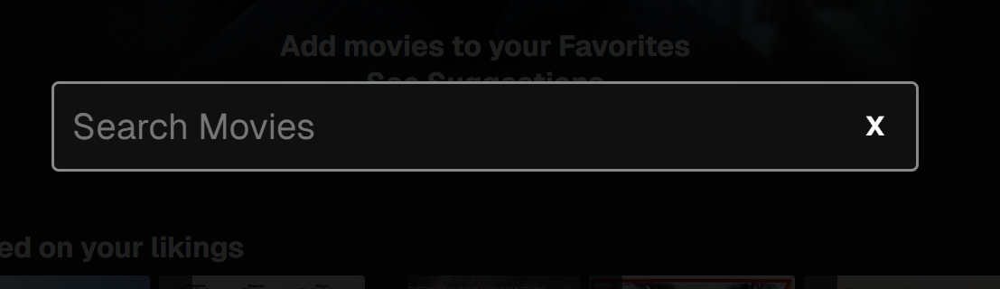
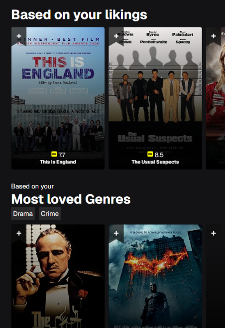
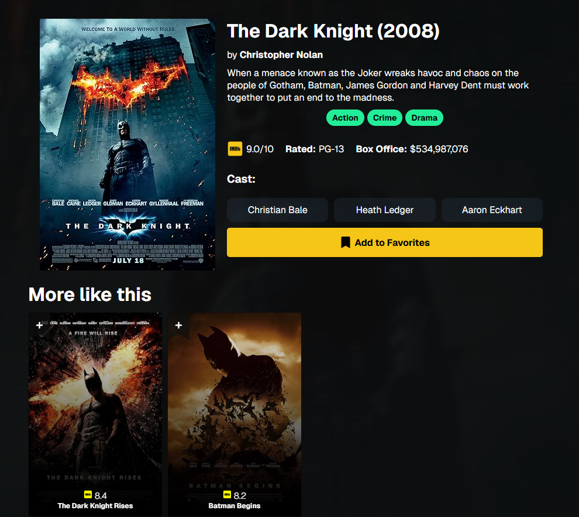
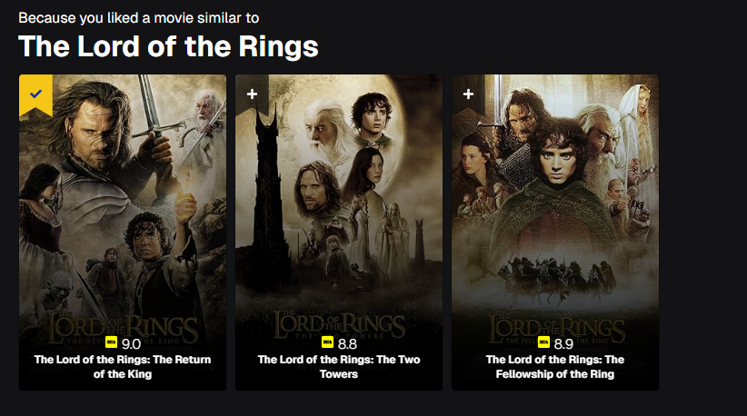

# 🎬 Movie Library App

A sleek and interactive movie library built with **Next.js**, fetching data from the **OMDb API** and utilizing **Appwrite** for authentication and user-specific collections.

---

## 🚀 Features

- 🔍 **Search movies** from the OMDb API
- ⭐ **Add movies to favorites & watchlist** (Appwrite database)
- 🔒 **User authentication** (Appwrite)
- 🎨 **Beautiful UI with animations**
- ⚡ **Optimized performance with Next.js**

---

## 📸 Screenshots

### 🔍 Search Movies


### ⭐ Reommendations based on your likings


### 🎥 Suggestions based on your most loved genres


### Suggestions based on collections


---

## 🛠️ Installation & Setup

### 1️⃣ Clone the Repository
```bash
git clone https://github.com/your-username/movie-library.git
cd movie-library
```

### 2️⃣ Install Dependencies
```bash
npm install
```

### 3️⃣ Create an `.env.local` file
```ini
NEXT_PUBLIC_APPWRITE_PROJECT_ID=your_project_id
NEXT_PUBLIC_APPWRITE_DATABASE_ID=your_database_id
NEXT_PUBLIC_APPWRITE_COLLECTION_ID_FAVORITES=your_collection_id
NEXT_PUBLIC_APPWRITE_COLLECTION_ID_WATCHLIST=your_collection_id
NEXT_PUBLIC_OMDB_API_KEY=your_omdb_api_key
```

### 4️⃣ Run the Development Server
```bash
npm run dev
```

Your app will be live at `http://localhost:3000`

---

## 🛠️ Deployment
To deploy the app on **Vercel**, follow these steps:
1. Push your code to GitHub.
2. Link your repository to Vercel.
3. Set environment variables in Vercel dashboard.
4. Deploy and enjoy! 🚀

---

## 🤝 Contributing
Feel free to fork the repository and submit pull requests. Any contributions are welcome! 💙

---

## 📜 License
This project is licensed under the **MIT License**.

---

### ⭐ If you like this project, give it a star on GitHub! ⭐

